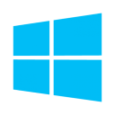

# Using Full Flash Update (FFU) files to speed up Windows deployment
<p align="center">
  
  
  
</p>

This repo is a fork of [rbalsleyMSFT](https://github.com/rbalsleymsft/FFU)'s FFU process that has been adapted for Windows deployments at the University of Georgia. Please see Richard's YouTube walkthrough on this project [here](https://www.youtube.com/watch?v=rqXRbgeeKSQ) [FFU](https://learn.microsoft.com/en-us/windows-hardware/manufacture/desktop/deploy-windows-using-full-flash-update--ffu?view=windows-11) is a sector-based imaging format that contains all the partitions of the drive that it is captured from. This can be contrasted with WIM, which is the [traditional imaging format](https://www.microsoft.com/en-us/download/details.aspx?id=13096) that is used with tools like Microsoft Deployment Toolkit, Configuration Manager, etc. A [WIM](https://learn.microsoft.com/en-us/windows-hardware/manufacture/desktop/capture-and-apply-windows-using-a-single-wim?view=windows-11) is a file-based imaging format that only contains the files from a single partition. WIMs are applied at the partition-level during deployment, whereas FFUs are applied at the drive-level. The main advantage of imaging with FFU files is that the deployment speed is much faster compared to WIM deployments due to being sector-based. This is significantly beneficial in mass deployment scenarios. For more information on these imaging formats, see [WIM vs. VHD vs. FFU: comparing imaging file formats](https://learn.microsoft.com/en-us/windows-hardware/manufacture/desktop/wim-vs-ffu-image-file-formats?view=windows-11).

The goal of this project is to provide a comprehensive Windows deployment solution using modern methods. This includes automating the process of building, capturing, and deploying a custom Windows image. As images quickly become out-of-date, maintaining or recreating them can become burdensome. Having an automated solution allows for any individual to quickly rebuild an up-to-date image. To broadly summarize, running the project will download Windows media from Microsoft, apply it to a VHDX file, and run it in a Hyper-V VM to install applications and apply customizations. Windows will then be [sysprepped](https://learn.microsoft.com/en-us/windows-hardware/manufacture/desktop/sysprep--generalize--a-windows-installation?view=windows-11), and once the VM shuts down, the FFU will be captured from the VHDX. The project can optionally prepare a deployment USB drive and copy the FFU, drivers, [provisioning packages](https://learn.microsoft.com/en-us/windows/configuration/provisioning-packages/provisioning-create-package), [Autopilot configuration files](https://learn.microsoft.com/en-us/autopilot/existing-devices), and other necessary components. Once the USB drive is booted into on a target device, the FFU will be applied to the drive automatically.

## Parent Project Contributions
Contributions to the [parent project](https://github.com/rbalsleymsft/FFU) include the following feature implementations:
- Automated the download and installation of the Windows ADK to eliminate a manual project prerequisite. [PR 14](https://github.com/rbalsleyMSFT/FFU/pull/14)
- Automated the upgrade of an existing ADK installation to the latest version. [PR 18](https://github.com/rbalsleyMSFT/FFU/pull/18)
- Added procedures and optimizations to reduce the size of the captured FFU. [PR 25](https://github.com/rbalsleyMSFT/FFU/pull/25)
- Added WinGet support. [PR 32](https://github.com/rbalsleyMSFT/FFU/pull/32), [PR 33](https://github.com/rbalsleyMSFT/FFU/pull/33), [PR 34](https://github.com/rbalsleyMSFT/FFU/pull/34), [PR 38](https://github.com/rbalsleyMSFT/FFU/pull/38)

All features and updates from the parent project are incorporated into this fork, which is regularly synchronized with upstream changes.

## Features Unique to This Fork
This fork contains unique functionality that would detract from either the goals or the generalized nature of the parent project.

- Removal of various in-box Windows apps commonly regarded as "bloatware"
- Application of a custom Windows theme
- Application of a custom lock screen
- Configuration of the public desktop
- Configuration various group policy settings derived from [Microsoft security baselines](https://www.microsoft.com/en-us/download/details.aspx?id=55319)
- Support for configuring computer names longer than 15 characters
- Dell BIOS configuration during imaging
- Automated download and installation of latest Dell driver pack during imaging
- Application of custom provisioning packages during imaging
- Automated Windows Autopilot registration during OOBE

## Prerequisites

Hyper-V must be enabled. To enable Hyper-V with PowerShell, open PowerShell as an administrator and run the following command:
```ps1
Enable-WindowsOptionalFeature -Online -FeatureName Microsoft-Hyper-V -All
```

Once the command finishes running, restart the computer.

## Getting Started

If you're not familiar with Github, you can click the Green code button above and select download zip. Extract the zip file and make sure to copy the FFUDevelopment folder to the root of your C: drive. That will make it easy to follow the guide and allow the scripts to work properly.
If extracted correctly, your c:\FFUDevelopment folder should look like the following. If it does, go to c:\FFUDevelopment\Docs\BuildDeployFFU.docx to get started.


